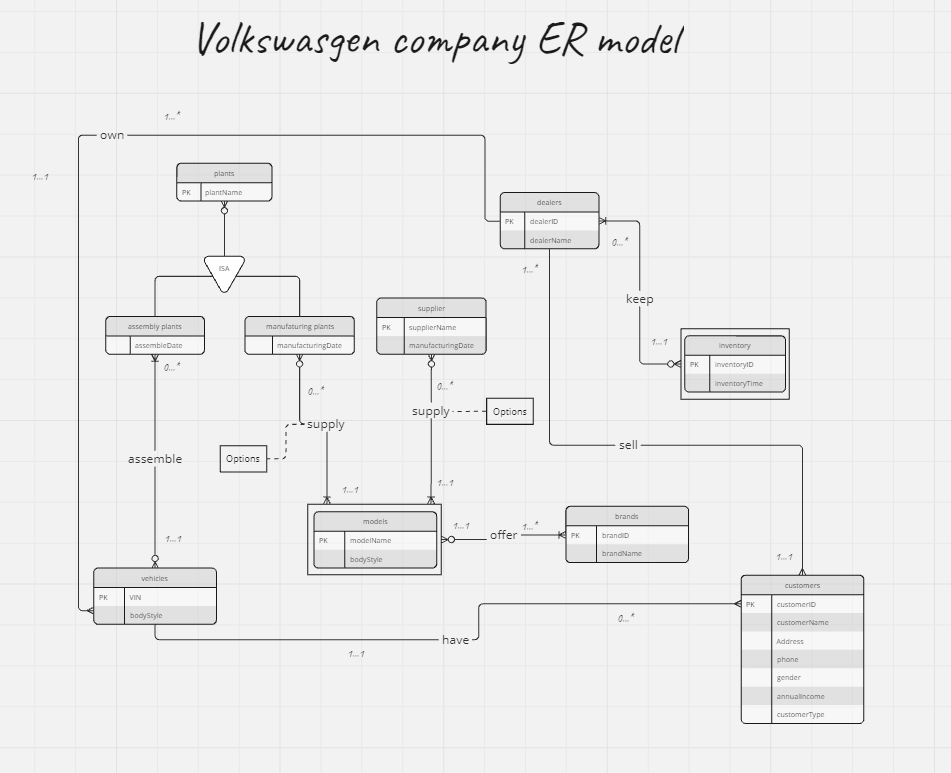

# Automobile Company Database Project

## Overview

This project involves designing and implementing a relational database for an automobile company. The database covers various aspects of the company's operations, including vehicles, brands, models, options, dealers, customers, suppliers, and manufacturing plants. The project includes the following components:
1. E-R Diagram
2. Relational Schema
3. Database Creation and Population
4. Sample Queries and Results

## Project Structure

The project repository is organized as follows:

```
¢u¢w¢w ER_Diagram/
¢x   ¢|¢w¢w er_diagram.png
¢u¢w¢w Relational_Schema/
¢x   ¢|¢w¢w relational_schema.png
¢u¢w¢w Database/
¢x   ¢u¢w¢w create_tables.sql
¢x   ¢u¢w¢w insert_data.sql
¢x   ¢|¢w¢w sample_queries.sql
¢u¢w¢w Results/
¢x   ¢|¢w¢w query_results.txt
¢u¢w¢w src/
¢x   ¢|¢w¢w main.py
¢u¢w¢w README.md
¢|¢w¢w requirements.txt
```

### Folder Descriptions

- **ER_Diagram**: Contains the E-R diagram of the database.
- **Relational_Schema**: Contains the relational schema diagram.
- **Database**: SQL scripts to create tables, insert data, and execute sample queries.
- **Results**: Contains the results of sample queries.
- **src**: Source code for interfacing with the database (e.g., a simple command-line interface).
- **README.md**: This README file.
- **requirements.txt**: Lists any dependencies required for running the project.

## E-R Diagram

The E-R diagram represents the conceptual design of the database, including all entity and relationship sets, primary keys, and cardinalities. It can be found in the `ER_Diagram` folder:



## Relational Schema

The relational schema diagram represents the logical design of the database. It includes the tables, columns, primary keys, and foreign keys. The diagram can be found in the `Relational_Schema` folder:


## Database Creation

To create and populate the database, execute the SQL scripts in the `Database` folder in the following order:

1. `create_tables.sql`: This script creates all the necessary tables.
2. `insert_data.sql`: This script populates the tables with sample data.

## Sample Queries

The `sample_queries.sql` script contains SQL queries that answer specific questions as required by the project. You can run this script to get the results, which are also provided in the `Results` folder.

### Sample Queries List

1. **Defective Transmissions Query**: Identifies cars with defective transmissions and their customers.
2. **Top Dealer by Sales**: Finds the dealer with the highest sales by dollar amount in the past year.
3. **Top 2 Brands by Unit Sales**: Identifies the top 2 brands by unit sales in the past year.
4. **Best Month for SUV Sales**: Determines the month(s) with the highest SUV sales.
5. **Dealers with Longest Inventory Time**: Finds dealers who keep vehicles in inventory for the longest average time.

## Running the Project

### Requirements

- Python 3.10 or above
- MariaDB (or any other relational database)
- Required Python packages listed in `requirements.txt`

### Instructions

1. Clone the repository:
   ```bash
   git clone https://github.com/Unforgettableeternalproject/DB_FinalProject
   cd <repository_name>
   ```
2. Install the necessary dependencies:
   ```bash
   pip install -r requirements.txt
   ```
3. Create and populate the database:
   ```bash
   sqlite3 automobile.db < Database/create_tables.sql
   sqlite3 automobile.db < Database/insert_data.sql
   ```
4. Run the sample queries:
   ```bash
   sqlite3 automobile.db < Database/sample_queries.sql
   ```
5. (Optional) Run the provided interface:
   ```bash
   python src/main.py
   ```

## Conclusion

This project demonstrates the full cycle of database development from conceptual design to implementation and querying. The provided E-R diagram and relational schema ensure a robust and scalable database design. The sample data and queries showcase the database's functionality and provide insights into the company's operations.

For any questions or issues, please contact Bernie, Charlie at ptyc4076@gmail.com, charlie930320@gmail.com.

---