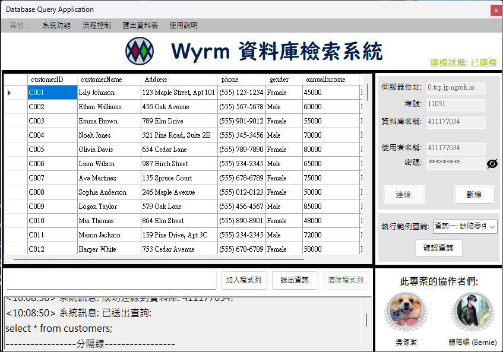

### 此專案提供多種語言之README文件
[](https://github.com/Unforgettableeternalproject/DB_FinalProject/blob/main/README.md) [](https://github.com/Unforgettableeternalproject/DB_FinalProject/blob/main/README.zh-tw.md)

---

# 汽車公司資料庫專案

## 概述

本專案涉及設計和實現一個汽車公司的關聯數據庫。數據庫涵蓋公司的各個運營方面，包括車輛、品牌、型號、選項、經銷商、客戶、供應商和製造廠。專案包括以下組成部分：
1. E-R 圖
2. 關聯模式
3. 數據生成與插入
4. 示例查詢和結果
5. 用戶界面（GUI）

## 專案結構

專案庫的組織結構如下：

```graphql
├── ER_Diagram/
│   └── er_diagram.png
├── Relational_Schema/
│   └── relational_schema.png
├── Results/
│   └── Example Query 1.png
│   └── Example Query 2.png
│   └── Example Query 3.png
│   └── Example Query 4.png
│   └── Example Query 5.png
│   └── User_Interface_Snapshot.png
├── src/
│   └── Generator/
│       └── RandomDataGenerator.py
│   └── ConnectionTest.py
│   └── ExampleQuery.py
├── README.md
├── README.zh-tw.md
└── requirements.txt
```

### 文件夾描述

- **ER_Diagram**: 包含數據庫的 E-R 圖。
- **Relational_Schema**: 包含關聯模式圖。
- **Results**: 包含範例查詢的結果。
- **src**: 包含數據生成器、數據庫連接測試和示例查詢腳本。
- **README.md**: 英文版本的 README 文件。
- **README.zh-tw.md**: 本 README 文件。
- **requirements.txt**: 列出了運行專案所需的依賴項。

## E-R 圖

E-R 圖表示數據庫的概念設計，包括所有實體和關係集、主鍵和基數。可以在 `ER_Diagram` 文件夾中找到：


## 關聯式模型

關聯式模型表示數據庫的邏輯設計。它包括表、列、主鍵和外鍵。可以在 `Relational_Schema` 文件夾中找到：


## 示例查詢

`src/ExampleQuery.py` 腳本包含回答專案要求的具體問題的 SQL 查詢。您可以運行此腳本以獲取結果，結果也提供在 `Results` 文件夾中。

### 示例查詢列表

1. **有缺陷的變速箱查詢**: 識別含有缺陷變速箱的汽車及其客戶。
2. **銷售額最高的經銷商**: 查找過去一年銷售額最高的經銷商。
3. **按銷量排名前兩位的品牌**: 識別過去一年銷量最高的兩個品牌。
4. **SUV 銷量最佳的月份**: 確定 SUV 銷量最高的月份。
5. **平均庫存時間最長的經銷商**: 查找將車輛保持在庫存中時間最長的經銷商。

## 用戶界面（GUI）

我們開發了一個用於查詢的 GUI，以方便使用。這個 GUI 可以從以下存放庫獲得：
[Wyrm-DB_GUI](https://github.com/Unforgettableeternalproject/Wyrm-DB_GUI-)

使用者介面截圖:


該 GUI 提供了連接到 MariaDB 數據庫並檢索信息的界面。用戶可以通過 GUI 輸入查詢並直接在應用程序中顯示結果。

## 運行專案

### 要求

- Python 3.10 以上
- MariaDB（或其他關聯數據庫）
- `requirements.txt` 中列出的 Python 依賴項

### 使用說明

1. 複製存放庫：
   ```bash
   git clone https://github.com/Unforgettableeternalproject/DB_FinalProject
   cd <repository_name>
   ```
2. 安裝必要的依賴項：
   ```bash
   pip install -r requirements.txt
   ```
3. 運行示例查詢：
   ```bash
   python src/ExampleQuery.py
   ```
4. （可選）運行提供的 GUI：
   ```bash
   git clone https://github.com/Unforgettableeternalproject/Wyrm-DB_GUI-
   cd Wyrm-DB_GUI-
   # 按照 Wyrm-DB_GUI- 的 README 指示配置和運行
   ```

## 結論

本專案展示了從概念設計到實施和查詢的完整數據庫開發流程。提供的 E-R 圖和關聯模式確保了數據庫設計的健壯性和可擴展性。示例數據和查詢展示了數據庫的功能，並提供了對公司運營的見解。

如有任何問題或疑問，請聯繫顏榕嶙(Bernie)與吳傢澂，電子信箱: [
](mailto:ptyc4076@gmail.com) [](mailto:charlie930320@gmail.com)。